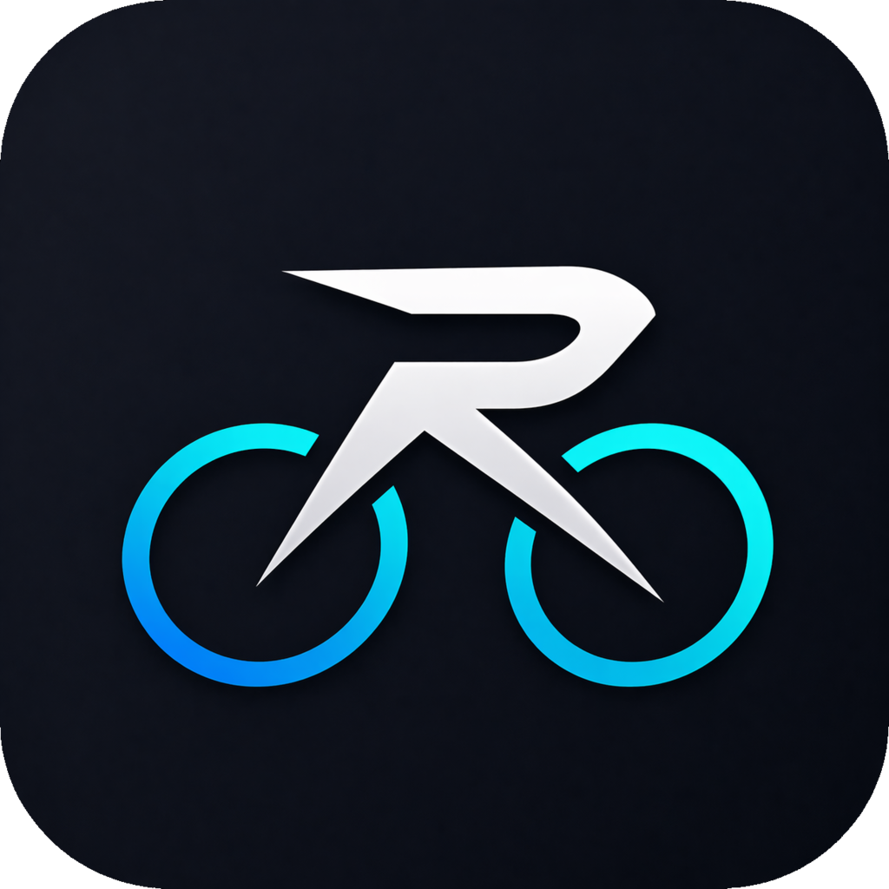
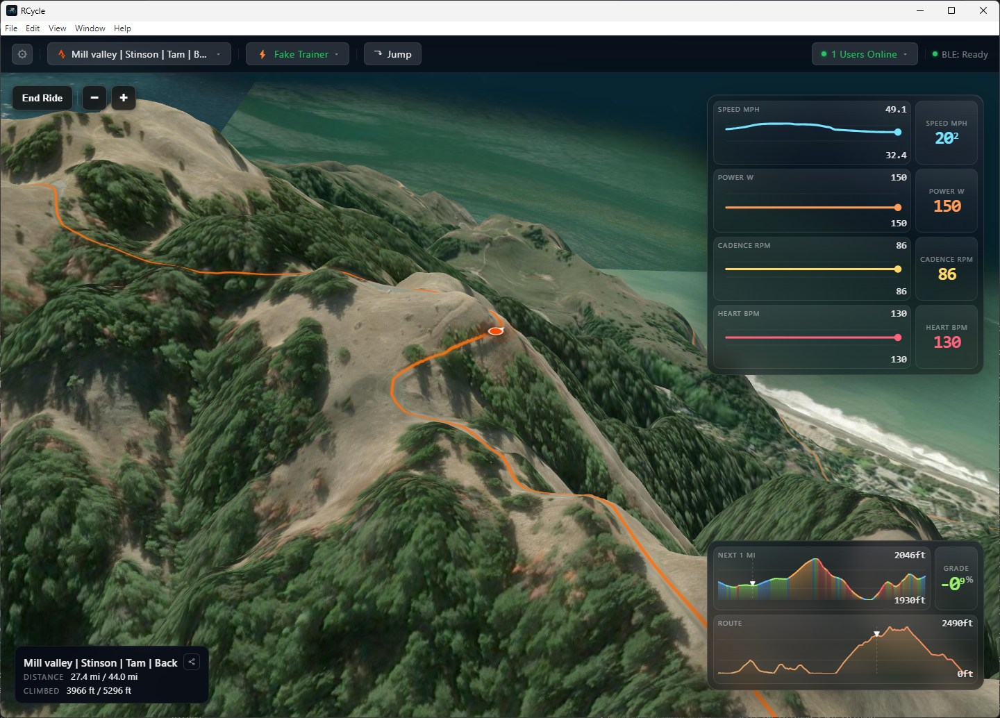

# RCycle

**Ride anywhere in the world, together.**

Indoor cycling app that turns any real-world route into a smart-trainer ride — with live multi-user support so you can see other riders around you, or ride together with friends.

 

---

## What it is

RCycle is an indoor cycling application that lets you simulate riding **any route in the world** on your smart trainer. Drop in a Strava activity or a GPX, and RCycle turns the real-world terrain into live resistance and grade changes on your trainer, while rendering the route around you. When you ride a route that other riders are on, you see them moving in real time — and you can ride together.

> **Early-stage beta.** Things will change, occasionally break, and get better quickly. Feedback is very welcome.

## Features

### Ride the real world
- **Any route, anywhere** — load Strava activities, routes, or GPX files; RCycle samples the real elevation profile and feeds it to your trainer as live grade.
- **Real terrain tiles** — satellite imagery and terrain DEM from public sources, so the route actually looks like the place.
- **Frontend-authoritative physics** — smooth, low-latency speed, distance, and position computed locally from your power, cadence, weight, and rider profile (CdA, Crr, drivetrain efficiency).
- **Live elevation HUD** — see where you are on the profile, with distance remaining and grade at a glance.

### Smart trainer support
- **FTMS smart trainers** — grade simulation, target power (ERG), resistance mode.
- **Heart-rate monitors**, **power meters**, **cadence and speed sensors** over BLE.
- **Native Bluetooth** — runs a local Python BLE bridge on your machine; no cloud round-trip for trainer commands.
- **Auto-reconnect** to your last-used trainer and HRM.

### Ride with other people
- **See nearby riders** — other people on the same route appear around you, in real time.
- **Ride together** — join a friend's route and ride side-by-side virtually, anywhere in the world.
- **Room for casual or structured group rides** — the same route, any time zone, any pace.

### Strava integration
- **Sign in with Strava.**
- **One-click upload** — finished rides post to your Strava account.
- **Browse your Strava history** from inside the app and re-ride any past activity.

### Nice things
- **Works offline for the core ride** once a route is loaded.
- **Auto-updates** via GitHub Releases.
- **No ads, no analytics, no tracking.**

## Requirements

- **Windows 10/11** (x64) or **macOS 12+** (Intel or Apple Silicon)
- Bluetooth LE adapter (built-in on most laptops)
- An FTMS-compatible smart trainer for grade/power control (any BLE HRM/power/cadence sensor also works)
- A Strava account (optional, required only for Strava features)

## Install

### Latest Stable

Stable builds are the default channel and are recommended for most riders. These links follow the latest stable GitHub Release after each stable publish.

| Platform | Download |
|---|---|
| **Windows** (x64) | [Latest stable Windows installer](https://github.com/thethereza/rcycle-package/releases/latest/download/RCycle-latest-win-x64.exe) |
| **macOS** (Apple Silicon) | Coming soon |
| **macOS** (Intel) | Coming soon |

### Latest Beta

Beta builds are prereleases. In the app, switch Settings -> Updates -> Beta to receive beta updates automatically.

| Platform | Download |
|---|---|
| **Windows** (x64) | [Latest beta release](https://github.com/thethereza/rcycle-package/releases) |
| **macOS** (Apple Silicon) | [Latest beta release](https://github.com/thethereza/rcycle-package/releases) |
| **macOS** (Intel) | Coming soon |

Run the Windows installer or extract the macOS zip and move RCycle to Applications. Updates are delivered automatically.

## Quick start

1. Launch RCycle.
2. Pair your smart trainer (and HRM, if you have one) in the device panel.
3. Sign in with Strava (optional).
4. Pick a route — import a GPX, paste a Strava activity/route, or jump to a location.
5. Start pedalling. The trainer will follow the real-world grade.
6. Finish the ride, review it, and upload to Strava with one click.

## Status and roadmap

RCycle is **early-stage beta**. Actively in development. Expect:

- Rough edges on less common trainers (please report them).
- Ongoing work on multi-user rooms, structured workouts, and route discovery.
- UI changes as the ride experience settles.

If you hit a bug or have a feature request, open an issue on this repo.

## License and terms

- [Privacy Policy](https://htmlpreview.github.io/?https://github.com/thethereza/rcycle-package/blob/main/privacy.html) — how your data is handled.
- Use of the Service is subject to the Terms of Service and Privacy Policy bundled with the app.
- Indoor cycling carries inherent physical risk. You use RCycle at your own risk.

## Credits

Map and terrain data: Esri World Imagery, AWS Terrain Tiles, MapLibre. Trainer control via the Bluetooth FTMS profile. Built with Electron, React, and a Python BLE bridge.

---

© 2026 RCycle · Questions? <a href="mailto:reza747895@gmail.com">reza747895@gmail.com</a>
